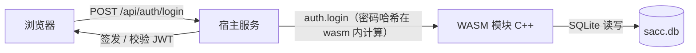

# 认证与账号体系（M1 实现）

> SACC 报名系统后端设计（[返回后端导航](index.md)）· 对应里程碑 M1 数据层核心

**范围**：注册、登录（失败锁定）、密码重置、会话（JWT）。配套实现见 [development.md](../development.md) M1。

## 一、认证架构

- **密码哈希在 wasm 内完成**：明文密码以 JSON 入参进入 `wasm_invoke`，仅以哈希落库，明文不离开模块。
- **会话由宿主签发**：宿主用 `node:crypto` 生成 / 校验 HMAC-SHA256 JWT（无外部依赖），`JWT_SECRET` 来自 `.env`。
- **无状态会话**：JWT 内置 `uid` 与过期时间（默认 7 天），登出由客户端删除 token 实现，无需服务端会话表。

## 二、密码存储（KDF 决策）

| 项 | 决策 |
|---|---|
| 算法 | **PBKDF2-HMAC-SHA256**（NIST SP 800-132，OWASP 认可） |
| 迭代 | 100,000 次（常量 `kPBKDF2Iterations`，随代码发布，可升级） |
| 盐 | 16 字节 CSPRNG 随机（WASI `random_get` / 原生 `/dev/urandom`），hex 存 `account.salt` |
| 哈希 | 32 字节输出，hex 存 `account.password_hash` |

> **相对原设计（scrypt / bcrypt）的调整**：wasm32 模块需自包含实现，scrypt/bcrypt 的完整 C 实现体量大、正确性风险高；PBKDF2-SHA256 自包含约 250 行、为标准算法，在登录/注册低频场景下性能可接受。若后续安全要求提升，可升级为 argon2/scrypt（哈希值前缀版本号即可平滑迁移）。

## 三、登录失败锁定策略

- 阈值：连续失败 **5 次**（常量 `kMaxLoginFail`）
- 每次失败 `login_fail_count + 1`；达到阈值时置 `lock_until = now + 900`（15 分钟）
- 锁定期间登录返回 403「失败次数过多，账号已锁定」；到点自动解锁（校验时对比 `lock_until > now`）
- 登录成功清零 `login_fail_count` 与 `lock_until`，更新 `last_login_at`
- 为防账号枚举，用户名不存在与密码错误统一返回 401「用户名或密码错误」

## 四、接口契约

统一响应 `{ code, data?, message? }`；错误码复用现有登记（host/src/errors.js ↔ frontend/src/api/errors.js，无新增）。

### wasm op（`wasm_invoke` 分发）

| op | 参数 | 返回 `data` | 错误 |
|---|---|---|---|
| `auth.register` | `username` `password` + 可选 `name` `student_id` `college` `phone` `email` | `{ uid, username, name, ... }` | 422 参数格式 / 409 用户名已存在 |
| `auth.login` | `username` `password` | `{ uid, username, name, email, ... }` | 401 用户名或密码错误 / 403 禁用或锁定 |
| `auth.me` | `uid` | 同 login 的用户资料 | 404 账号不存在 |
| `auth.reset_request` | `email` | `{ ok: true, token }`（⚠ M1 联调临时返回 token，**上线前必须移除**，见下方安全注意） | 422 邮箱格式 |
| `auth.reset_confirm` | `token` `new_password` | `{ ok: true }` | 422 令牌无效或已过期 |

### host HTTP 路由

| 方法 | 路径 | 说明 |
|---|---|---|
| POST | `/api/auth/register` | 注册成功即签发 JWT → `{ token, user }` |
| POST | `/api/auth/login` | 登录成功签发 JWT → `{ token, user }` |
| GET | `/api/auth/me` | `Authorization: Bearer <token>` → `{ user }` |
| POST | `/api/auth/logout` | 无状态登出，返回 `{ ok: true }`（客户端删除 token） |
| POST | `/api/auth/password/reset` | 重置申请（按 `user.email`） |
| POST | `/api/auth/password/reset/confirm` | 重置确认（token + 新密码） |

## 五、密码重置流程

1. `auth.reset_request(email)`：按 `user.email` 查账号（不存在也返回成功，防枚举）；生成 32 字节随机 `reset_token`，`reset_expire = now + 3600`（1 小时）。
2. `auth.reset_confirm(token, new_password)`：校验 token 存在且未过期 → 重算盐与哈希 → 更新密码，清空 token。
3. 邮件送达由宿主 SMTP 完成（M1 暂未接入；开发期接口直接返回 token 便于联调，接入 SMTP 后改由邮件发送）。

> ⚠ **安全注意（全链路审计 Issue 2）**：`auth.reset_request` 无认证门槛，联调阶段直接返回 `token`——任何知道已注册邮箱的人可借此重置他人密码（未认证账号接管）。**接入 SMTP 后必须移除 token 返回**（改为仅 `{ ok: true }`），并建议增加验证码 / 限流；上线前强制执行。

## 六、安全与边界

- 密码长度须为 8~128 位；用户名 3~32 位 `[A-Za-z0-9_]`
- 注册 `account` + `user` 同一事务（`BEGIN IMMEDIATE`），用户名冲突唯一约束兜底
- `auth.me` 仅返回公开资料，不含 `password_hash` / `salt` / `reset_token`
- 所有字符串参数 UTF-8；时间戳 Unix 秒（INTEGER）
- JWT 载荷仅含 `uid`、`username`、`iat`、`exp`，不存敏感信息
