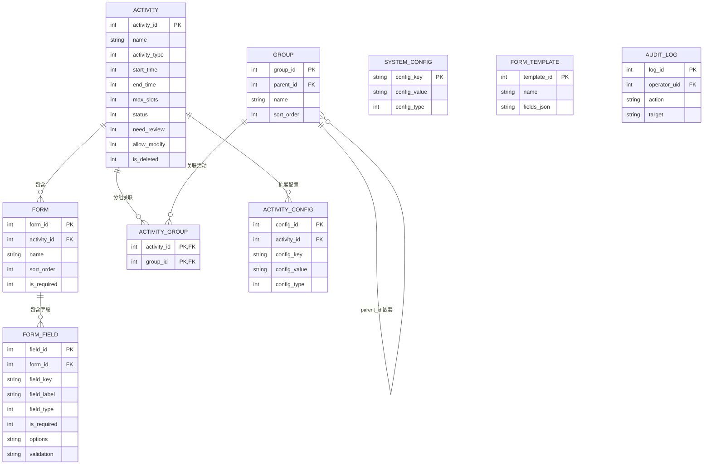

# 配置层设计

> SACC 报名系统后端设计 · 分层文档（[返回后端导航](index.md)）

**职责**：活动、分组、表单字段及配置预留项的**定义**，由管理端配置，运行时只读。

## ER 图

## 表设计

**`activity`**（报名活动）

| 字段 | 类型 | 说明 |
|---|---|---|
| activity_id | INTEGER PK | 活动 id |
| name / description | TEXT | 名称 / 描述 |
| activity_type | INTEGER | 活动形式：0 线下 / 1 线上 / 2 混合（新增形式时登记枚举） |
| start_time / end_time | INTEGER | 报名起止时间 |
| max_slots | INTEGER | 名额上限（0 不限） |
| status | INTEGER | 0 草稿 / 1 进行中 / 2 已截止 / 3 已结束 |
| need_review | INTEGER | 报名是否需审核：0 否 / 1 是 |
| allow_modify | INTEGER | 报名后截止前是否可修改：0 否 / 1 是 |
| is_deleted | INTEGER | 软删除：0 否 / 1 是 |
| created_at | INTEGER | 创建时间 |

**`form`**（表单 / 步骤）

| 字段 | 类型 | 说明 |
|---|---|---|
| form_id | INTEGER PK | 表单 id |
| activity_id | INTEGER | → `activity` |
| name | TEXT | 表单名称 |
| sort_order | INTEGER | 填写步骤顺序 |
| is_required | INTEGER | 0 选填 / 1 必填 |
| is_deleted | INTEGER | 软删除：0 否 / 1 是 |
| created_at | INTEGER | 创建时间 |

**`group`**（分组，可嵌套）

| 字段 | 类型 | 说明 |
|---|---|---|
| group_id | INTEGER PK | 分组 id |
| parent_id | INTEGER | → `group`（NULL 为顶级） |
| name | TEXT | 分组名称 |
| sort_order | INTEGER | 同级显示顺序 |
| is_deleted | INTEGER | 软删除：0 否 / 1 是 |
| created_at | INTEGER | 创建时间 |

**`activity_group`**（活动-分组关联，多对多）

| 字段 | 类型 | 说明 |
|---|---|---|
| activity_id | INTEGER | → `activity` |
| group_id | INTEGER | → `group` |

唯一约束 `(activity_id, group_id)`。

**`form_field`**（字段，管理员配置报名信息）

| 字段 | 类型 | 说明 |
|---|---|---|
| field_id | INTEGER PK | 字段 id |
| form_id | INTEGER | → `form` |
| field_key / field_label | TEXT | 键名 / 显示名 |
| field_type | INTEGER | 0 文本 / 1 数字 / 2 单选 / 3 多选 / 4 日期 / 5 文件 |
| is_required | INTEGER | 0 选填 / 1 必填 |
| options | TEXT | 选项 JSON（单选/多选用） |
| default_value / placeholder / validation | TEXT | 默认值 / 占位提示 / 校验规则（JSON，支持条件联动） |
| is_visible / is_editable | INTEGER | 是否可见 / 是否可编辑 |
| is_deleted | INTEGER | 软删除：0 否 / 1 是 |
| remark | TEXT | 备注（文件类可写类型白名单） |
| sort_order | INTEGER | 显示顺序 |
| created_at | INTEGER | 创建时间 |

字段定义只追加、不物理删除、`field_key` 不可变更；下线置 `is_deleted=1`，避免历史 `registration_data` 引用失效。

**`form_template`**（表单模板，独立快照）

| 字段 | 类型 | 说明 |
|---|---|---|
| template_id | INTEGER PK | 模板 id |
| name | TEXT | 模板名称 |
| description | TEXT | 说明 |
| fields_json | TEXT | 字段定义快照（`form_field` 字段集 JSON 数组，含默认值/校验） |
| created_at | INTEGER | 创建时间 |

套用模板时按 `fields_json` 生成 `form` / `form_field` 记录；模板为独立快照，不参与运行时，不设外键。

**`activity_config`**（活动级扩展配置预留）

| 字段 | 类型 | 说明 |
|---|---|---|
| config_id | INTEGER PK | 配置项 id |
| activity_id | INTEGER | → `activity` |
| config_key | TEXT | 配置键（如 `review_mode`、`notify_channel`） |
| config_value | TEXT | 配置值 |
| config_type | INTEGER | 值类型：0 布尔 / 1 数字 / 2 文本 / 3 JSON |
| remark | TEXT | 说明 |
| updated_at | INTEGER | 最近更新时间 |

唯一约束 `(activity_id, config_key)`；`config_key` 用常量枚举登记。按活动形式配置：场地 `venue_name` / `venue_address`（线下）、参会 `meeting_link` / `meeting_pwd`（线上）、签到方式 `checkin_mode`（0 现场扫码 / 1 线上自助 / 2 线上动态码，见 [registration.md](registration.md) 六）、通知渠道 `notify_channel`。

**`system_config`**（全局配置预留）

| 字段 | 类型 | 说明 |
|---|---|---|
| config_key | TEXT PK | 配置键（如 `site_name`、`max_upload_size`） |
| config_value | TEXT | 配置值 |
| config_type | INTEGER | 值类型：0 布尔 / 1 数字 / 2 文本 / 3 JSON |
| description | TEXT | 说明 |
| updated_at | INTEGER | 最近更新时间 |

**`audit_log`**（管理操作日志）

| 字段 | 类型 | 说明 |
|---|---|---|
| log_id | INTEGER PK | 日志 id |
| operator_uid | INTEGER | 操作人 → `user` |
| action | TEXT | 操作（如 `update_activity`） |
| target | TEXT | 操作对象 |
| detail | TEXT | 变更内容（JSON） |
| created_at | INTEGER | 操作时间 |
