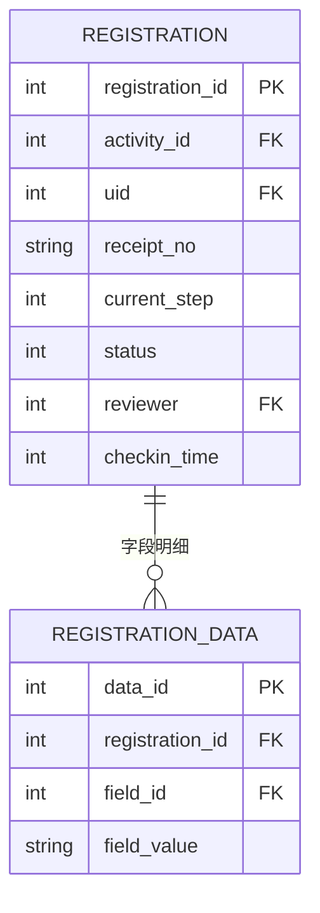

# 数据层设计

> SACC 报名系统后端设计 · 分层文档（[返回后端导航](index.md)）

**职责**：报名记录及字段明细，**运行时数据**。

## ER 图

## 表设计

**`registration`**（报名记录）

| 字段 | 类型 | 说明 |
|---|---|---|
| registration_id | INTEGER PK | 报名 id |
| activity_id | INTEGER | → `activity` |
| uid | INTEGER | → `user` |
| receipt_no | TEXT | 报名凭证编号（提交时生成） |
| current_step | INTEGER | 当前表单步骤 |
| queue_no | INTEGER | 候补序号（仅候补状态） |
| status | INTEGER | 0 填写中 / 1 待审核 / 2 已通过 / 3 未通过 / 4 已取消 / 5 候补 |
| reviewer | INTEGER | 审核人 → `user`（NULL 未审核） |
| review_time | INTEGER | 审核时间 |
| review_remark | TEXT | 审核意见 / 驳回理由 |
| checkin_time | INTEGER | 签到时间（NULL 未签到；线下扫码或线上签到时写入） |
| created_at / updated_at | INTEGER | 报名 / 更新时间 |

唯一约束 `(activity_id, uid)`，防止同一用户重复报名。

**`registration_data`**（字段明细）

| 字段 | 类型 | 说明 |
|---|---|---|
| data_id | INTEGER PK | 明细 id |
| registration_id | INTEGER | → `registration` |
| field_id | INTEGER | → `form_field` |
| field_value | TEXT | 填写内容（文件类存路径或 URL） |

唯一约束 `(registration_id, field_id)`。

**存储约定**：`field_value` 按 `field_type` 规范化——数字/日期固定格式、多选 JSON 数组、文件存路径。EAV 不适合聚合统计，导出/统计在导出层逐条解析。

## 状态机

| 当前状态 | 触发事件 | 下一状态 | 条件 |
|---|---|---|---|
| 0 填写中 | 提交 | 1 待审核 | `need_review=1` |
| 0 填写中 | 提交 | 2 已通过 | `need_review=0` |
| 1 待审核 | 审核通过 | 2 已通过 | 审核人写入 `reviewer/review_time` |
| 1 待审核 | 审核驳回 | 3 未通过 | 写入 `review_remark` |
| 3 未通过 | 修改后重新提交 | 1 待审核 | `allow_modify=1` |
| 0 / 1 / 2 / 5 | 用户取消 | 4 已取消 | 截止前，释放名额 |
| 0 / 1 | 修改保存 | 0 填写中 | `allow_modify=1`，已提交记录回退 |
| 5 候补 | 有名额递补 | 1 待审核 | `need_review=1` |
| 5 候补 | 有名额递补 | 2 已通过 | `need_review=0` |
| 2 已通过 | 活动结束 | 保持 | 历史状态归档 |
