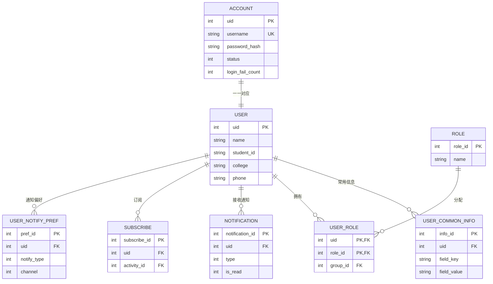

# 用户层设计

> SACC 报名系统后端设计 · 分层文档（[返回后端导航](index.md)）

**职责**：登录账号、权限角色、身份资料、常用信息、通知与订阅，**跨活动复用**。

## ER 图

## 表设计

**`account`**（登录账号）

| 字段 | 类型 | 说明 |
|---|---|---|
| uid | INTEGER PK | 账号 id（与 `user.uid` 对应） |
| username | TEXT | 登录用户名（唯一） |
| password_hash / salt | TEXT | 密码哈希 + 盐（不存明文） |
| status | INTEGER | 0 正常 / 1 禁用 |
| login_fail_count | INTEGER | 连续登录失败次数（达上限锁定） |
| lock_until | INTEGER | 锁定截止时间（NULL 未锁定，到时自动解锁） |
| reset_token / reset_expire | TEXT / INTEGER | 密码重置令牌 / 有效期 |
| last_login_at / created_at | INTEGER | 最近登录 / 注册时间 |

**`user`**（身份资料）

| 字段 | 类型 | 说明 |
|---|---|---|
| uid | INTEGER PK | UID |
| name / student_id / college / phone | TEXT | 姓名 / 学号 / 学院专业 / 联系方式 |
| email | TEXT | 邮箱（密码重置 / 邮件通知渠道） |
| created_at | INTEGER | 注册时间 |

**`user_common_info`**（常用报名信息）

| 字段 | 类型 | 说明 |
|---|---|---|
| info_id | INTEGER PK | 信息 id |
| uid | INTEGER | → `user` |
| field_key / field_label / field_value | TEXT | 字段键 / 显示名 / 常用值（对应 `form_field.field_key`，报名自动预填） |
| updated_at | INTEGER | 最近更新时间 |

唯一约束 `(uid, field_key)`。

**预填规则**：基础资料（`name`/`student_id`/`college`/`phone`）取 `user`；其余按 `field_key` 匹配 `user_common_info`，冲突以本次填写为准；`field_key` 命名空间化防跨活动误匹配。

**`role`**（角色）

| 字段 | 类型 | 说明 |
|---|---|---|
| role_id | INTEGER PK | 角色 id |
| name | TEXT | 角色名（超级管理员 / 活动管理员 / 审核员） |
| description | TEXT | 说明 |

**`user_role`**（用户-角色，含管理范围）

| 字段 | 类型 | 说明 |
|---|---|---|
| uid | INTEGER | → `user` |
| role_id | INTEGER | → `role` |
| group_id | INTEGER | 管理范围 → `group`（NULL 全部，非 NULL 仅该分组及子分组） |

唯一约束 `(uid, role_id)`。

**`notification`**（通知）

| 字段 | 类型 | 说明 |
|---|---|---|
| notification_id | INTEGER PK | 通知 id |
| uid | INTEGER | 接收人 → `user` |
| type | INTEGER | 0 报名成功 / 1 审核结果 / 2 活动提醒 / 3 候补（扩展见 [registration.md](registration.md) 十二） |
| title / content | TEXT | 标题 / 内容 |
| is_read | INTEGER | 0 未读 / 1 已读 |
| channel | INTEGER | 0 站内信 / 1 邮件 |
| send_status | INTEGER | 0 待发送 / 1 已发送 / 2 永久失败（无邮箱或重试达上限；邮件由宿主 SMTP 发送，异常置 0 自动重试） |
| attempt_count | INTEGER | 邮件发送尝试次数（0005 迁移新增；每失败 +1，达上限置 send_status=2 终止重试） |
| created_at | INTEGER | 通知时间 |

**`subscribe`**（活动订阅）

| 字段 | 类型 | 说明 |
|---|---|---|
| subscribe_id | INTEGER PK | 订阅 id |
| uid | INTEGER | → `user` |
| activity_id | INTEGER | → `activity` |
| created_at | INTEGER | 订阅时间 |

唯一约束 `(uid, activity_id)`。

**`user_notify_pref`**（通知偏好）

| 字段 | 类型 | 说明 |
|---|---|---|
| pref_id | INTEGER PK | 偏好 id |
| uid | INTEGER | → `user` |
| notify_type | INTEGER | 通知类型（同 `notification.type`） |
| channel | INTEGER | 渠道（同 `notification.channel`） |
| updated_at | INTEGER | 最近更新时间 |

唯一约束 `(uid, notify_type)`；未配置的通知类型按活动 `notify_channel` 默认渠道发送。

**`user_pref`**（界面偏好）

| 字段 | 类型 | 说明 |
|---|---|---|
| uid | INTEGER | → `user` |
| pref_key | TEXT | 偏好键 |
| pref_value | TEXT | 偏好值 |
| updated_at | INTEGER | 最近更新时间 |

主键 `(uid, pref_key)`；界面偏好存储（0006 迁移新增，对应 `/api/me/prefs`）。
