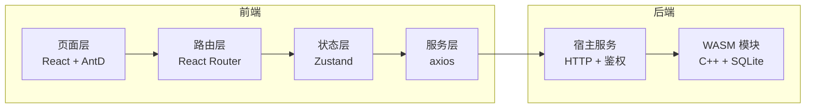

# 前端架构

> SACC 报名系统前端设计（[返回前端导航](index.md)）

## 一、总体架构

| 层 | 技术 | 职责 |
|---|---|---|
| 页面层 | React 组件 + Ant Design 5 | 渲染与交互 |
| 路由层 | React Router | 路由与角色守卫 |
| 状态层 | Zustand | auth、活动、报名草稿、通知等全局状态 |
| 服务层 | axios | 调用后端接口，token / 错误统一处理 |

## 二、技术栈

| 项 | 选型 | 说明 |
|---|---|---|
| UI | antd ^5 | 表格 / 表单 / 树 / 抽屉 / 上传，后台生态成熟 |
| 路由 | react-router | 权限路由 |
| 状态 | zustand | 轻量，按域拆多个 store |
| 请求 | axios | 拦截器注入 token、统一错误提示 |
| 数据缓存 | TanStack Query | 服务端状态缓存（见 data-optimization） |
| 图表 | @ant-design/charts | 数据看板 |
| 二维码 | qrcode.react | 报名凭证 |

## 三、权限模型

角色来自 `user_role`（超级管理员 / 活动管理员 / 审核员）+ 普通用户。

- 菜单与路由按角色渲染，未授权访问返回 403
- 管理端数据按 `user_role.group_id` 递归子分组过滤，与后端权限判定一致
- 页面级：`PermissionGuard`；按钮级：`usePermission`

## 四、路由总览

| 路径 | 页面 | 角色 | 布局 |
|---|---|---|---|
| /login · /register · /forgot-password | 登录 / 注册 / 忘记密码 | 公开 | AuthLayout |
| /workbench | 我的工作台 | 用户 | UserLayout |
| /activities | 活动大厅 | 用户 | UserLayout |
| /activities/:id | 活动详情 | 用户 | UserLayout |
| /activities/:id/register | 报名表单（分步） | 用户 | UserLayout |
| /my-registrations | 我的报名 | 用户 | UserLayout |
| /my-registrations/:id | 报名详情 / 凭证 | 用户 | UserLayout |
| /notifications | 通知中心 | 用户 | UserLayout |
| /profile | 资料 / 常用信息 / 通知偏好 | 用户 | UserLayout |
| /admin/workbench | 管理员待办 | 管理员 / 审核员 | AdminLayout |
| /admin/activities | 活动管理 | 管理员 | AdminLayout |
| /admin/activities/create · /:id/edit | 活动编辑（含表单设计器） | 管理员 | AdminLayout |
| /admin/activities/:id/registrations | 报名名单 | 管理员 / 审核员 | AdminLayout |
| /admin/activities/:id/review | 审核队列 | 审核员 | AdminLayout |
| /admin/activities/:id/checkin | 签到核销 | 管理员 | AdminLayout |
| /admin/activities/:id/statistics | 数据看板 | 管理员 | AdminLayout |
| /admin/templates | 表单模板 | 管理员 | AdminLayout |
| /admin/overview | 全局工作台 | 超管 | AdminLayout |
| /admin/groups | 分组管理 | 超管 | AdminLayout |
| /admin/users | 账号管理 | 超管 | AdminLayout |
| /admin/roles | 角色与授权 | 超管 | AdminLayout |
| /admin/config | 配置中心 | 超管 | AdminLayout |
| /admin/audit-log | 审计日志 | 超管 | AdminLayout |
| /admin/system | 数据治理 | 超管 | AdminLayout |
