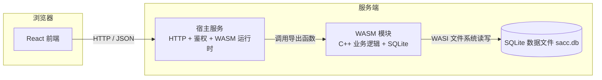

# WebAssembly 后端技术方案

> SACC 报名系统后端设计（[返回后端导航](index.md)）

后端采用 **C++ 编译为 WebAssembly（wasm32-wasi）+ SQLite**，运行于**服务端 WASM 运行时**（Wasmtime / Wasmer / Node.js）。浏览器只负责展示，所有业务逻辑与数据处理在服务端 wasm 模块内完成。

## 一、总体架构

## 二、模块边界

| 层 | 实现 | 职责 |
|---|---|---|
| 前端 | React | 展示与交互，不接触数据 |
| 宿主服务 | Node.js / Go / Rust | HTTP 解析、会话鉴权、静态资源、调度 WASM 调用 |
| WASM 模块 | C++ + SQLite | **全部业务与数据逻辑**（分层设计中的全部表操作） |
| 存储 | SQLite 单文件 | 持久化 |

宿主不直接操作数据库，所有 SQL 与事务在 wasm 模块内完成，SQL 不泄漏到浏览器端。

## 三、编译与运行

- 编译目标：`wasm32-wasi`
- 工具链：clang 的 wasm32-wasi target 或 Emscripten；CMake 构建
- 运行时：Wasmtime / Wasmer / Node.js（WASI 支持）。宿主语言建议 **Rust**（`wasmtime` crate，性能与 ABI 控制最佳）或 **Node.js**（开发效率高）；Go 对 WASI 支持较弱，不建议。
- SQLite：以 C 源码**静态编译进 wasm**，无外部原生依赖
- 产物：`backend.wasm` + 宿主程序

## 四、WASM 导出接口（C ABI）

宿主通过共享内存 + 调用导出函数完成业务，入参出参均为 JSON 字符串：

| 函数 | 对应业务 |
|---|---|
| `wasm_register` / `wasm_login` | 注册 / 登录（密码哈希在模块内计算） |
| `wasm_create_activity` / `wasm_update_activity` | 活动管理 |
| `wasm_add_group` / `wasm_add_form` / `wasm_add_field` | 分组 / 表单 / 字段配置 |
| `wasm_create_registration` / `wasm_submit_registration` | 报名创建 / 提交 |
| `wasm_review_registration` | 审核（通过 / 驳回） |
| `wasm_list_registrations` / `wasm_export_registrations` | 查询 / 导出 |
| `wasm_export_chunk(offset, limit)` | 分页导出，避免大文件一次性过共享内存 |
| `wasm_get_config` / `wasm_set_config` | 配置读写 |

- 内存约定：`wasm_alloc` 分配宿主传入 buffer，结果写入共享线性内存，宿主读取后 `wasm_free` 释放。

## 五、SQLite 与并发

- **单写者模型**：wasm 模块默认单线程，宿主以互斥锁 / 操作队列**串行化所有写调用**。
- 与现有"名额并发"设计配合：报名采用条件更新（已报名数 < `max_slots` 才成功），在串行化下天然防超卖。
- WAL 模式：读不阻塞写。
- 数据文件 `sacc.db` 通过 WASI 文件系统映射到宿主磁盘目录，支持在线备份（SQLite backup API）。

## 六、安全

- 密码哈希（scrypt / bcrypt）在 wasm 模块内计算，明文不离开模块。
- 会话 token 由宿主生成与校验（可存于 `account` 表或宿主独立存储）。
- wasm 沙箱隔离，宿主与模块间仅走既定 ABI，无任意代码注入面。
- 登录失败锁定沿用 `account.login_fail_count` 设计。

## 七、部署

- **单实例**：宿主进程内嵌 wasm 模块 + SQLite 文件即可上线。
- **多实例**：SQLite 单文件不适合多进程并发写，建议保持单实例；如必须水平扩展，需引入共享存储 + 单写者协调（文件锁 / 选主），或后续引入外部数据库。
- **备份**：定时调用 backup API 生成备份文件。

## 八、与现有分层设计的关系

**表结构与功能设计无需调整**，三层结构、ER 图、跨层关联、设计要点（审核流 / 候补 / 权限 / 软删除 / 配置预留）全部保持不变。

| 现有设计 | WASM 方案中的落点 |
|---|---|
| 配置层 / 用户层 / 数据层表操作 | 全部在 wasm 模块内实现 |
| `audit_log` 操作日志 | wasm 模块内记录，宿主转发 |
| 名额并发（条件更新防超卖） | 宿主串行化写调用后执行 |
| `system_config` / `activity_config` | 读写经 `wasm_get_config` / `wasm_set_config` |

**需补充的技术约束**：

1. **写操作串行化**：宿主层对 wasm 写调用加锁或排队（单写者），对应"名额并发"设计点的实现前提。
2. **WASI 文件系统映射**：明确 `sacc.db` 在宿主磁盘的路径映射与备份策略。
3. **大数据量导出**：wasm32 线性内存上限 4GB，导出/统计需分页或流式处理。

## 九、限制与注意

- wasm32 线性内存上限 4GB，大数据量注意内存。
- 单线程 → 写并发受限；报名高峰期若成瓶颈，在宿主层排队 / 限流。
- WASI 网络能力有限，所有网络 IO 由宿主完成，wasm 不直接监听端口。
- scrypt / bcrypt 在 wasm 内计算，注册 / 登录调用频率低，性能可接受；如担心可迁到宿主侧计算。
